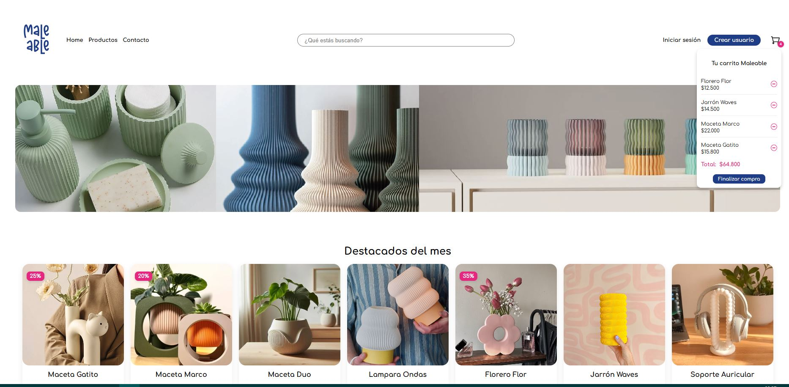
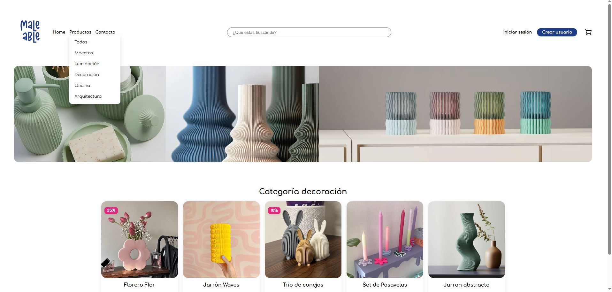
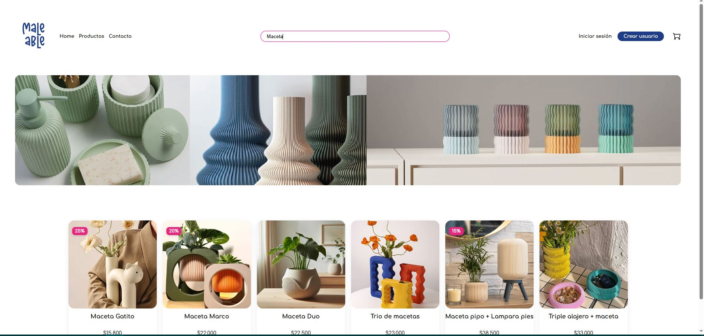

# Maleable Tienda Online 🛒

- Segunda entrega proyecto de tienda online desarrollada en **React**.
- Objetos mockeados para representación visual.

## Integrante / Profesor a cargo 👤

- Misiaszek, Lucía 
- Profesor: Sevilla, Ivan  

## Estructura de ramas 🔧

- **main**: Rama principal.
- **entrega-1**: Rama de desarrollo para la primera entrega y pruebas.  
- **entrega-2**: Rama de desarrollo para la psegunda entrega y pruebas. 

## Tecnologías 🚀

- React (Frontend)
- TypeScript
- CSS Modules (Estilos)
- Git (Control de versiones)

## Requisitos 📦

- **Node.js** versión >= 16.x  
- **npm** versión >= 8.x  
- React y dependencias definidas en `package.json` (se instalan con `npm install`)  

## Instalación ⚙️

```bash
# Clonar el repositorio
git clone https://github.com/Lumisiaszek/Informatorio-React
cd entrega-1

# Instalar las dependencias necesarias
npm install

# Iniciar el servidor de desarrollo
npm run dev

# Acceder al proyecto desde el navegador
http://localhost:5173/
```

## Capturas de la web 📷
 
 
 

 ## Video de funcionamiento 🎥
 - Podes encontrar el video en la carpeta **screenshots_video**
 - Tambien podes verlo haciendo [**click acá**](https://drive.google.com/file/d/1bQysk29DypdLUcRJhrB4etzc2xcfAJCm/view?usp=sharing)

<br>

## **Gracias por visitar este repo 🙌**
✨ Proyecto realizado como tienda e-commerce de mi emprendimiento de impresión 3D.<br>
